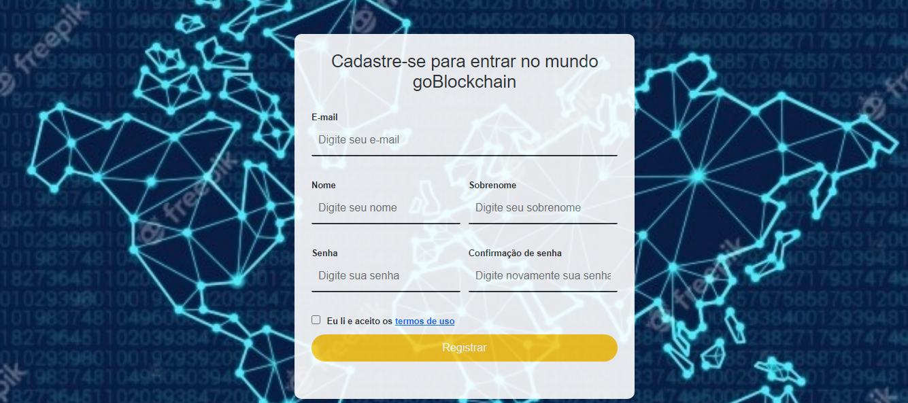
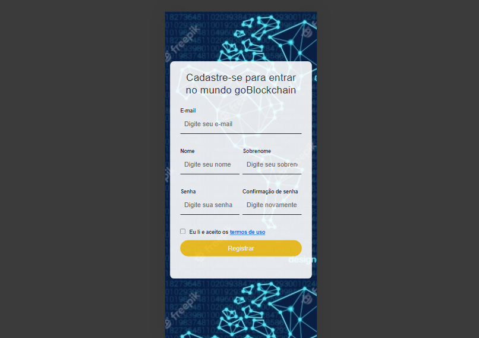

 # Tela de cadastro 

 <h1 align="center">
  
</h1>

 <a href="#tecnologia">Tecnologias</a> •
 <a href="#projeto">Projeto</a> • 
 <a href="#tecnologias">Tecnologias</a> • 
 <a href="#layout">Layout</a> • 
 <a href="#Licença">Licença</a> • 

<h2 align="left" class="tecnologia">🧠Tecnologias</h2>
<ul>
<li>CSS
<li>JavaScript
<li>BootStrap
</ul>

<h2 align="left" class="projeto">🥷🏼 Projeto</h2>
Tela de cadastro com validações em javaScript.

 Validações feitas em javascript que serão necessarias para logar nessa tela de cadastro
<ul> Campo Email:
<li> O campo precisa ter pelo menos 2 caracteres
<li>Insira um e-mail no padrão goblockchain@email.com(caso não for inserido um padrão de email valido)
</ul>
<ul> Campo Nome:
<li>O campo precisa ter pelo menos 3 caracteres
<li>Este campo é obrigatório
<li>O campo precisa ter menos que 16 caracteres
</ul>
<ul> Campo Sobrenome:
<li>Este campo não aceita caracteres especiais
<li>Este campo é obrigatório
</ul>
<ul> Campo Senha:
<li>A senha precisa um caractere maiúsculo e um número
<li>Este campo é obrigatório
</ul>
<ul> Campo Confirmação de Senha:
<li>Este campo precisa estar igual ao password
</ul>
<ul> CheckBox
<li>alerta  de aviso para aceitar os termos de uso.
</ul

<h2 align="left" class="layout"> 📱Layout</h2>
layout responsivo para celulares usando bootstrap

<h1 align="center">
  
</h1>

<h2 align="left" class="Licença">📝 licença</h2>
Esse projeto está sob a licença MIT.

<h2 align="left" class="App">📲 App</h2>
Para rodar esse app na sua maquina copie esse codigo e clone ele na sua maquina: git@github.com:wallaceAzevedo/web-com-bootstrap-e-javascript.git  
para rodar o app após clonar somente clique no index na sua pasta.